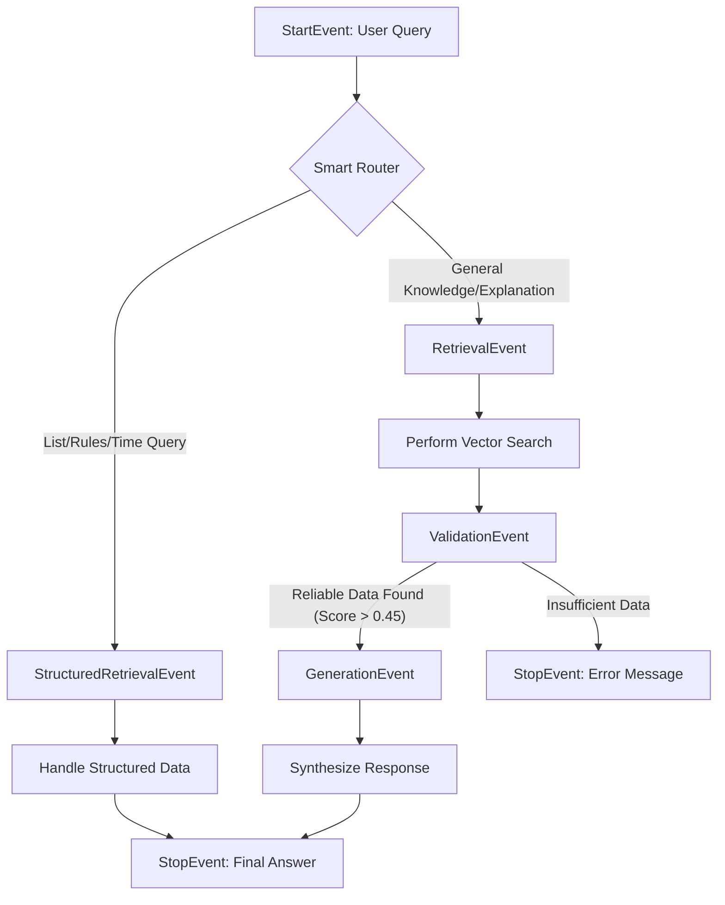

# 🚀 Agentic Event-Driven RAG System

An advanced Event-Driven RAG system built using **LlamaIndex Workflows**. The system combines Semantic Search with Structured Data Extraction to deliver accurate, consistent, and data-driven answers in real time.

---

## 🎯 Project Goal

This project addresses the common issue of *hallucinations* in standard RAG systems, especially in queries that require aggregation (e.g., lists) or chronological accuracy.

Using a structured schema (JSON) and a smart router, the agent autonomously decides whether to:

* Retrieve information from raw documents
* Use a pre-extracted structured data store

---

## 🏗️ System Architecture



---

## 🛠️ Installation & Setup

### 1️⃣ Install Requirements

Make sure you have Python 3.10 or higher installed, then run:

```bash
pip install llama-index llama-index-llms-cohere gradio pydantic
```

---

### 2️⃣ Environment Variables

Set the following API keys:

```bash
COHERE_API_KEY=your_cohere_api_key
PINECONE_API_KEY=your_pinecone_api_key
```

> You can use any other Vector Store instead of Pinecone

---

### 3️⃣ Data Preparation (Extraction)

Before running the system, generate the structured data:

```bash
python scripts/extract_data.py
```

This will create:

```bash
structured_data.json
```

---

### 4️⃣ Run the System

To launch the Gradio interface:

```bash
python main.py
```

---

## 💬 Example Queries

### 📂 Structured Retrieval Path

The system will choose this path for queries such as:

* "Give me a list of all technical decisions made in the project"
* "What are the updated RTL guidelines in the interface?"
* "Which security warnings were flagged in the past week?"

---

### 🔍 Semantic Search Path

The system will choose this path for queries such as:

* "How does the system handle network errors?"
* "Explain the relationship between the Frontend and the API based on the documentation"
* "What is the purpose of the Ingestion component in the system?"

---

## ⚙️ Technologies Used

* **LlamaIndex Workflows** – Event-driven workflow orchestration
* **Cohere Command-R** – LLM optimized for RAG
* **Gradio** – Interactive user interface
* **Pydantic** – Schema definition and data validation

---

## 🧠 Key Advantages

* Reduced hallucinations
* Hybrid structured + unstructured retrieval
* Intelligent query routing
* High accuracy for complex queries
* Support for time-based and list-based queries

---

## 📌 Notes

* Make sure your API keys are valid
* It is recommended to rerun the extraction step when data is updated
* The system can be extended with any Vector DB or LLM

---

## 📄 License

This project is open for use under a license of your choice (MIT / Apache 2.0, etc.)
